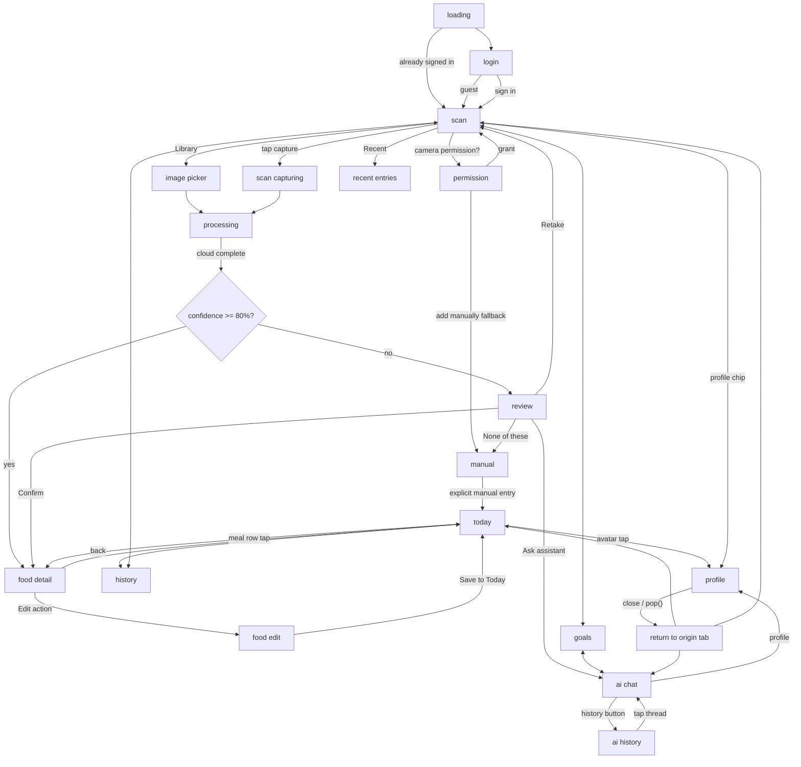

# Complete Handoff Screens and Product Quality Design

**Date:** 2026-07-17
**Status:** Approved design specification
**Scope:** All 19 canonical screen/state IDs, dual themes, navigation, motion, persistence, E2E, and verification

---

## 1. Source-of-Truth Hierarchy

1. `requirements.md`
2. `docs/design-handoff/placeholder-app/README.md`
3. `.claude/design.md`
4. This document (operational spec for implementation)

JSX source in `docs/design-handoff/placeholder-app/src/` is exact visual truth. Reference PNGs in `reference-images/` are visual gates. When code and PNG disagree, the code wins. Gradients/glows may band in PNG exports; use JSX or `preview/screens.html` as ground truth for those elements.

---

## 2. Canonical Screen/State Inventory (19 IDs)

Each ID maps to exactly one JSX file, one or more reference PNGs (dark + light), and a set of acceptance criteria.

| # | ID | JSX Source | Reference PNGs | Current Flutter State | Gap |
|---|---|---|---|---|---|
| 1 | `loading` | `cx-screen-loading.jsx` | `loading--dark.png`, `loading--light.png` | `loading_screen.dart` exists | Verify parity |
| 2 | `login` | `cx-screen-login.jsx` | `login--dark.png`, `login--light.png` | `login_screen.dart` exists | Verify parity |
| 3 | `permission` | `cx-screen-states.jsx` | `permission--dark.png`, `permission--light.png` | **Missing** | New screen |
| 4 | `scan_idle` | `cx-screen-scan.jsx` | `scan_idle--dark.png`, `scan_idle--light.png` | `scan_screen.dart` exists, needs nav rework | Nav + parity |
| 5 | `scan_capturing` | `cx-screen-scan.jsx` | `scan_capturing--dark.png`, `scan_capturing--light.png` | Exists (capturing state) | Parity |
| 6 | `processing` | `cx-screen-processing.jsx` | `processing--dark.png`, `processing--light.png` | `processing_screen.dart` exists | Parity |
| 7 | `review` | `cx-screen-states.jsx` | `review--dark.png`, `review--light.png` | **Missing** | New screen |
| 8 | `manual` | `cx-screen-states.jsx` | `manual--dark.png`, `manual--light.png` | **Missing** | New screen |
| 9 | `today` | `cx-screen-today.jsx` | `today--dark.png`, `today--light.png` | `today_screen.dart` exists | Parity |
| 10 | `today_empty` | `cx-screen-today.jsx` | `today_empty--dark.png`, `today_empty--light.png` | Exists (empty state) | Parity |
| 11 | `food` | `cx-screen-food.jsx` | `food--dark.png`, `food--light.png` | `food_detail_sheet.dart` exists | Parity |
| 12 | `food_edit` | `cx-screen-food.jsx` | `food_edit--dark.png`, `food_edit--light.png` | Exists (edit mode) | Parity |
| 13 | `history_week` | `cx-screen-history.jsx` | `history_week--dark.png`, `history_week--light.png` | `history_screen.dart` exists | Parity |
| 14 | `history_month` | `cx-screen-history.jsx` | `history_month--dark.png`, `history_month--light.png` | Exists (month toggle) | Parity |
| 15 | `goals` | `cx-screen-goals.jsx` | `goals--dark.png`, `goals--light.png` | `goals_screen.dart` exists | Parity |
| 16 | `goals_select` | `cx-screen-goals.jsx` | `goals_select--dark.png`, `goals_select--light.png` | Exists (period dropdown) | Parity |
| 17 | `ai` | `cx-screen-ai.jsx` | `ai--dark.png`, `ai--light.png` | `ai_chat_screen.dart` exists | Parity + history |
| 18 | `ai_history` | `cx-screen-ai-history.jsx` | `ai_history--dark.png`, `ai_history--light.png` | **Missing** | New screen |
| 19 | `profile` | `cx-screen-profile.jsx` | `profile--dark.png`, `profile--light.png` | `profile_sheet.dart` partial | Complete to parity |

### Supplementary states (derived, not separate IDs)
- `lock_notification` — OS surface, not a Flutter screen; implement as a rich push notification mock only.
- `food_edit` is the editing branch of `food` (ID 12); both share one route.

**Visual state count:** 19 canonical IDs × 2 themes = 38 visual states. `scan_capturing` (ID 5), `food_edit` (ID 12), and `goals_select` (ID 16) are already among the 19 canonical IDs, not behavior-only variants layered on top of the count. Behavior-only, noncanonical cases — processing complete/error, camera denial/regrant transitions, stale notification taps, offline/interrupted upload, rapid taps, keyboard states, and repeated screen visits — are additional acceptance cases verified within their parent screen's acceptance criteria, and do not inflate the 38.

---

## 3. Navigation Decision

### 3.1 Flat Five-Tab Navigation (Option 2 — Adopted)

**All screens, including Scan, use the same five equal-width bottom nav items. No floating FAB anywhere.**

- Tab order: Today · History · Scan · Goals · AI
- All five items have identical width (`Expanded` in a `Row`).
- Scan tab is highlighted identically to any other active tab (accent dot + bolder icon stroke). No gradient ring, no oversized circle, no overhang.
- On the Scan screen, the large still-photo capture button is the only dominant circle, positioned as a camera control element above the nav bar — not part of the nav itself.
- Bottom nav material/height/transparency is consistent across all screens. The "floating" translucent variant over the camera is retained for visual lightness but with equal-width items, not a FAB shape.
- No gradient ring on the Scan nav item. No halo. No separate `_ScanFAB` widget.

### 3.2 Horizontal Swipe Navigation

- Swipe left/right between adjacent main tabs (Today ⇄ History ⇄ Scan ⇄ Goals ⇄ AI).
- Product policy: direct manipulation zones (sliders, horizontal carousels, calendar gestures, text selection) always win over tab swipe. Tab swipe may initiate from non-interactive content only.
- Transition must be interruptible and preserve per-tab state (scroll position, route stack, form state).
- **Implementation spike required before committing to an approach.** The spike compares:
  1. Custom `navigatorContainerBuilder` on `StatefulShellRoute` with per-branch nested navigators
  2. `PageView` wrapping branch bodies with per-tab `IndexedStack`
  3. Shell-level swipe recognition with branch transition animation
- The spike must prove nested horizontal controls (calendar strip, slider, scroller) do not conflict with tab-level swipe. Only after tests demonstrate working conflict resolution should one approach be adopted. Do not lock in a brittle exact implementation before the spike completes.
- Gesture conflict zones to test:
  - History calendar week/month horizontal strip
  - Goals kcal slider thumb drag
  - Food detail serving multiplier stepper
  - AI chat horizontal suggested-prompts scroller
- Cold start always lands on Scan. Tab/scroll/route state is preserved only during: profile open/close, background/resume, and in-process tab changes. The active tab is not persisted across cold restart.

### 3.3 Profile Return to Origin

- Profile is opened via `context.pushNamed(RouteNames.profile)` (pushes onto the root navigator stack).
- Closing profile (`context.pop()`) returns to the exact origin screen/tab, not Scan.
- The close button and swipe-down gesture both call `context.pop()`.
- AI chat close button: `context.pop()` returns to the exact origin when AI was opened from an origin (e.g., food detail "Ask AI"). A stale/deep-link fallback may go to Scan, but this fallback path must be tested and visibly intentional — not a silent default.

---

## 4. Camera Model

**Live preview + still-photo capture. Never a video-recording model.**

### 4.1 Camera Flows

| Flow | Trigger | Behavior |
|---|---|---|
| Happy path (permission granted) | App open → Scan tab | Live preview fills screen; capture button takes still photo |
| Permission denied | First launch or Settings → Camera denied | `permission` screen: iOS camera alert overlay on blurred viewfinder + "add manually" fallback card |
| Barcode mode | Scan mode selector → Barcode | Live preview with barcode viewfinder overlay; auto-capture on detection |
| Label mode | Scan mode selector → Label | Live preview with text-detection overlay; capture still of nutrition label |
| Library upload | "LIBRARY" chip | `ImagePicker` from gallery; same processing path as camera capture |
| Processing | After capture/upload | Navigate to `processing` screen; user can close app; push notification returns |
| Review | Confidence < 80% | `review` screen: photo hero + bottom sheet with candidate corrections, None-of-these, Confirm, Ask AI |
| Manual | Camera denied fallback, review "None of these", explicit manual entry action, or custom-food creation | `manual` screen: search field, filter chips, result rows, "create custom food" |
| Interrupted upload | App backgrounded during upload | Upload queue retries; notification still delivered on completion |
| Notification return | Tap push notification | Deep-link opens `today` or `food` detail depending on state |

---

## 5. Screen-by-Screen Specification

### 5.1 `loading` (ID 1)

**JSX:** `cx-screen-loading.jsx`
**Reference:** `loading--dark.png`, `loading--light.png`
**Current:** `loading_screen.dart` exists. Verify parity against handoff.

**Acceptance criteria:**
- Halo pulse around brand mark (cyan radial gradient, ~2.6s repeat)
- Tick ring with 60 marks, spinning gradient arc (~28% sweep, 1.8s linear)
- Four staged progress labels: WAKING SENSORS → CONNECTING · AI CLOUD → SYNCING TODAY → READY
- Determinate progress bar with brand gradient fill
- Dot mesh texture with radial fade
- Version/status pill top-center
- Minimum 1.8s splash beat before navigation
- Dark: `#0F1319` base; Light: `#F7F5F0` base
- All numerals tabular (`FontFeature.tabularFigures()`)

### 5.2 `login` (ID 2)

**JSX:** `cx-screen-login.jsx`
**Reference:** `login--dark.png`, `login--light.png`
**Current:** `login_screen.dart` exists.

**Acceptance criteria:**
- Email + password fields, Apple/Google social buttons, guest button
- Trust chips (security/privacy badges)
- Brand mark and tagline
- Smooth keyboard avoidance
- Auth state redirect: signed in → scan; signed out → login

### 5.3 `permission` (ID 3)

**JSX:** `cx-screen-states.jsx` (permission branch)
**Reference:** `permission--dark.png`, `permission--light.png`
**Current:** **Missing.** No Flutter implementation.

**Acceptance criteria:**
- Renders platform-appropriate permission UX: on iOS, an iOS-style camera permission alert as an in-app overlay (not the real OS dialog); on Android, the equivalent Android permission-rationale/dialog treatment. In visual-fixture mode (ui-diff capture), render the handoff's iOS-style overlay to preserve the mockup's visual intent regardless of capture platform — this is a fixture concession, not a claim that Android must exactly imitate an iOS alert in production.
- Blurred viewfinder behind the alert
- "Add manually" fallback card below the alert
- Theme-aware (dark/light)
- Triggers on first launch or when camera permission is denied
- Tapping "Add manually" navigates to `manual` screen
- Granting permission (simulated or real) transitions to `scan_idle`

### 5.4 `scan_idle` (ID 4)

**JSX:** `cx-screen-scan.jsx` (idle state)
**Reference:** `scan_idle--dark.png`, `scan_idle--light.png`
**Current:** `scan_screen.dart` exists. Nav needs rework per §3.1.

**Acceptance criteria:**
- Full-screen camera preview (or placeholder when unavailable)
- Glass chrome top bar: flash chip (Auto/On/Off cycle), profile chip (avatar initials or person icon)
- Mode selector: Meal · Barcode · Label (segmented glass pill)
- Reticle overlay: four rounded corner brackets, 280×280
- Hint pill: "FRAME YOUR MEAL · TAP ONCE"
- Capture controls: LIBRARY chip (left), capture button (center), RECENT chip (right)
- **Capture button:** large circle, 80px, gradient core when idle, rotating sweep ring when capturing. This is the only dominant circle on screen.
- Bottom nav: five equal-width tabs, consistent material/height. No FAB. Scan tab active with accent dot.
- Glass bottom nav over camera: translucent variant (blur 20, reduced opacity)
- No gradient ring on Scan nav item

### 5.5 `scan_capturing` (ID 5)

**JSX:** `cx-screen-scan.jsx` (capturing state)
**Reference:** `scan_capturing--dark.png`, `scan_capturing--light.png`
**Current:** Exists as `CaptureState.capturing` branch.

**Acceptance criteria:**
- Reticle glows (mask blur filter)
- Conic spinner on capture button (blue→cyan→green sweep, 1s linear repeat)
- Scan-line shimmer passes vertically through reticle box (~1.6s linear infinite)
- Hint pill changes to "ANALYZING…"
- Capture button shows brief shutter/reticle/ring animation (flash + ring pulse), then disables duplicate taps during capture
- This is a still-photo capture, not video recording. No stop square, no cancel button. The brief capture animation completes and transitions to processing.

### 5.6 `processing` (ID 6)

**JSX:** `cx-screen-processing.jsx`
**Reference:** `processing--dark.png`, `processing--light.png`
**Current:** `processing_screen.dart` exists.

**Acceptance criteria:**
- Glass banner: "You can close the app" with rotating spinner + "We'll send a notification when ready"
- Tapping banner navigates to today
- Skeleton card: image shimmer, title skeleton, macro bar skeletons, step counter (3/4)
- Completed state: food image, name, kcal, macro bars, "View in Today" button
- Error state: amber icon, "Analysis failed", retry button
- Shimmer animation: ~1.4s linear infinite, skeleton base/shine colors per theme

### 5.7 `review` (ID 7)

**JSX:** `cx-screen-states.jsx` (review branch)
**Reference:** `review--dark.png`, `review--light.png`
**Current:** **Missing.** No Flutter implementation.

**Acceptance criteria:**
- Photo hero (captured food image, full-width)
- Bottom sheet with:
  - Confidence badge (amber, <80%)
  - Candidate radio list (AI-suggested food items)
  - "None of these" option
  - "Confirm" button (primary action)
  - "Ask AI" link
  - "Retake" action
- "Not right?" correction prompt
- Navigation: Confirm → food detail; Retake → scan; Manual → manual; Ask AI → ai chat with meal context
- Smooth slide-up transition for the bottom sheet (~320ms ease)

### 5.8 `manual` (ID 8)

**JSX:** `cx-screen-states.jsx` (manual branch)
**Reference:** `manual--dark.png`, `manual--light.png`
**Current:** **Missing.** No Flutter implementation.

**Acceptance criteria:**
- Search field with filter chips (category filters)
- Result rows with food name, macro summary, and "+" button to add
- Dashed "create custom food" row at bottom
- Manual entry form: food name, calories, protein, carbs, fat, serving size, quantity, meal type
- Theme-aware (dark/light)
- Reachable from: permission denied fallback, review "None of these", explicit manual entry action, custom-food creation

### 5.9 `today` (ID 9)

**JSX:** `cx-screen-today.jsx`
**Reference:** `today--dark.png`, `today--light.png`
**Current:** `today_screen.dart` exists.

**Acceptance criteria:**
- Header: eyebrow date label + "Today" title + notification bell + avatar circle
- Hero macro ring card: CXMacroRing (3 concentric rings), kcal eaten counter (count-up ~1.4s easeOutCubic), "of target" label, kcal-left pill (green)
- Macro rows: Protein (blue), Carbs (cyan), Fat (green) — each with progress bar, grams, target, percentage
- Recent scans section: header + count badge
- Meal cards: thumbnail, food name, kcal, time, macro pips, confidence badge
- Empty state: zeroed ring + "No meals logged yet" + camera CTA
- Bottom nav: five equal-width tabs
- Notification bell: placeholder (no action yet)
- Avatar: taps → profile (push, not go)

**Fixture-truth note:** the reference Today mockup intentionally shows a static hero summary of 1,420 kcal / 96g protein / 132g carbs / 38g fat even though its three visible meal cards sum to 845 kcal / 74g protein / 92g carbs / 20g fat. This discrepancy is allowed only inside the deterministic visual fixture/override used for ui-diff screenshot comparison; it must never leak into production aggregation, and E2E nutrition-correctness assertions must keep summing real entry data, not the fixture's hero override.

### 5.10 `today_empty` (ID 10)

**JSX:** `cx-screen-today.jsx` (empty state)
**Reference:** `today_empty--dark.png`, `today_empty--light.png`
**Current:** Exists as `_EmptyMeals` branch.

**Acceptance criteria:**
- Hero ring shows zero values (all rings unfilled)
- "No meals logged yet" message
- "Tap Scan to photograph your meal" subtext
- First-run CTA visible

### 5.11 `food` (ID 11)

**JSX:** `cx-screen-food.jsx`
**Reference:** `food--dark.png`, `food--light.png`
**Current:** `food_detail_sheet.dart` exists.

**Acceptance criteria:**
- Hero photo (full-width, 320px tall) with glass Back button + duplicate/delete chips
- Confidence pill (pulsing green dot + percentage, if available)
- Sheet body overlapping hero: detected label, food name, serving info
- Kcal banner with serving multiplier stepper (0.25× steps, 0.25–5.0×)
- Macro edit rows: protein/carbs/fat with progress bars, editable values
- Detected items chips (name + weight)
- "Not right? Ask AI to fix this" card
- Edit mode toggle (chip) → edit action bar (Undo + Save to Today)
- Draggable scrollable sheet behavior

### 5.12 `food_edit` (ID 12)

**JSX:** `cx-screen-food.jsx` (edit state)
**Reference:** `food_edit--dark.png`, `food_edit--light.png`
**Current:** Exists as `_isEditMode` branch in `food_detail_sheet.dart`.

**Acceptance criteria:**
- Edit chip toggles to filled/inverted state
- Macro values become tappable → numeric input bottom sheet
- Serving multiplier stepper appears in kcal banner
- "Add item" chip appears in detected items section
- Bottom action bar: Undo (outlined) + Save to Today (filled)
- Save persists to Firestore, marks entry as corrected, pops back

### 5.13 `history_week` (ID 13)

**JSX:** `cx-screen-history.jsx` (week view)
**Reference:** `history_week--dark.png`, `history_week--light.png`
**Current:** `history_screen.dart` exists.

**Acceptance criteria:**
- Header: week number + month eyebrow, "History" title, left/right chevrons
- Calendar card: week strip (Mon–Sun pills with day rings), W/M toggle
- Weekly stats card: average kcal/day, target percentage badge, sparkline chart, macro mini-stats
- Day log rows: date, kcal, meal count, macro pips, chevron
- Streak pill (fire icon + count)
- Navigation: day row → history day detail (food list for that day)

### 5.14 `history_month` (ID 14)

**JSX:** `cx-screen-history.jsx` (month view)
**Reference:** `history_month--dark.png`, `history_month--light.png`
**Current:** Exists as `_isMonthView` toggle branch.

**Acceptance criteria:**
- Month grid: 7-column grid, day numbers, status dots (green/amber)
- Today highlighted with cyan border
- Future days dimmed
- Same weekly stats and day log section below calendar
- Smooth animated size transition between week/month (~300ms ease-in-out)

### 5.15 `goals` (ID 15)

**JSX:** `cx-screen-goals.jsx`
**Reference:** `goals--dark.png`, `goals--light.png`
**Current:** `goals_screen.dart` exists.

**Acceptance criteria:**
- Period pill: plan name + week/month label + dropdown chevron
- "Goals" title (30px, tight tracking)
- Adjust button (top right)
- Body goal segmented control: Lose fat / Maintain / Lean+ / Custom
- Calorie card: daily target, AI TDEE badge, multiplier stepper, gradient slider
- Macro split card: stacked bar (protein/carbs/fat), three target tiles with grams + g/kg
- Weight card: latest weight, delta, 30-day chart, "Log weight" button
- Period dropdown: week/month options with checkmark

### 5.16 `goals_select` (ID 16)

**JSX:** `cx-screen-goals.jsx` (dropdown open state)
**Reference:** `goals_select--dark.png`, `goals_select--light.png`
**Current:** Exists as `_periodOpen` state in `goals_screen.dart`.

**Acceptance criteria:**
- Dropdown anchored under period pill
- Transparent barrier dismisses on tap
- Week rows (Week N with date range)
- Month rows (Month Year with sublabel)
- Active item highlighted with cyan tint + checkmark
- Smooth entrance animation

### 5.17 `ai` (ID 17)

**JSX:** `cx-screen-ai.jsx`
**Reference:** `ai--dark.png`, `ai--light.png`
**Current:** `ai_chat_screen.dart` exists.

**Acceptance criteria:**
- Header: gradient icon (blue→cyan), "AppName AI" title, "CAN EDIT YOUR PLAN" status, close button
- Gradient separator line (blue→cyan→green, 80 alpha)
- Message list with:
  - User bubbles: blue-tinted, right-aligned, bottom-left tail
  - Assistant bubbles: surface-colored, left-aligned, bottom-right tail
  - **Fix:** user bubbles must be right-aligned (currently correct in code)
  - Time separators (h:mm a, with dividers)
- Confirmation cards: AI ACTION badge, old→new value row with delta chip, Keep original / Apply buttons
- Typing indicator: three pulsing dots (600ms repeat, staggered 200ms)
- Suggested prompts: horizontal scroller (Plan remaining macros, Adjust for fat loss, etc.)
- Composer: add button, text field ("Ask anything…"), mic button, gradient send button
- **Persisted chat threads:** history button in header → `ai_history` screen
- Close button: returns to origin, not Scan

### 5.18 `ai_history` (ID 18)

**JSX:** `cx-screen-ai-history.jsx`
**Reference:** `ai_history--dark.png`, `ai_history--light.png`
**Current:** **Missing.** No Flutter implementation.

**Acceptance criteria:**
- Header: "AI History" title with back button
- Thread list: each item shows preview text, timestamp, optionally linked meal name
- Tap thread → opens `ai` screen with that thread's messages loaded
- Empty state: "No conversations yet" with CTA to start chatting
- Swipe-to-delete on thread items
- Theme-aware (dark/light)

### 5.19 `profile` (ID 19)

**JSX:** `cx-screen-profile.jsx`
**Reference:** `profile--dark.png`, `profile--light.png`
**Current:** `profile_sheet.dart` partial implementation.

**Acceptance criteria (complete to parity):**
- Handle bar (drag to dismiss, tap to close)
- "Profile" title with close button
- User info card: avatar circle (initials), display name, email, sign-in status
- Link account card (if anonymous): "Sign in with Google" with subtitle
- Theme selector: System / Light / Dark segmented button
- Notifications toggle
- Units setting (metric/imperial)
- Camera settings (resolution, auto-capture)
- Legal section: Privacy Policy, Terms of Service, Version
- Sign out button (red outlined, with confirmation dialog)
- **Return to origin:** close button and swipe-down both `context.pop()` to return to the exact screen that opened profile

---

## 6. Navigation Architecture



### 6.1 Route Structure (go_router)

```
StatefulShellRoute.indexedStack
├── Branch 0: /today
│   └── /today/food/:id  (FoodDetailSheet)
├── Branch 1: /history
│   └── /history/:date   (HistoryDayScreen)
├── Branch 2: /scan
├── Branch 3: /goals
├── Branch 4: /ai
│   └── /ai/history      (AiHistoryScreen) [new]

Root routes (outside shell):
├── /loading
├── /login
├── /processing/:id
├── /profile             (ProfileSheet, push)
```

### 6.2 Horizontal Swipe (Post-Spike)

- **Implementation depends on spike outcome (§3.2).** Options include `PageView` wrapping branch bodies, custom `navigatorContainerBuilder`, or shell-level swipe recognition.
- `Physics`: `BouncingScrollPhysics` (iOS feel) or `ClampingScrollPhysics` (Android feel) — chosen per platform after spike
- Gesture conflict zones to validate during spike:
  - History: `_WeekStrip` and `_MonthGrid` horizontal gesture within their bounds
  - Goals: `_GradientKcalSlider` horizontal drag must not bubble to tab swipe
  - Food detail: serving stepper is vertical-only (no conflict)
  - AI: suggested prompts horizontal scroller must consume drags within its viewport
- Product policy: direct manipulation zones always win over tab swipe; tab swipe initiates from non-interactive content only
- Transition must be interruptible and preserve per-tab state
- Do not commit to a specific gesture resolution approach before the spike proves it works

---

## 7. Motion Specification

### 7.1 Animation Catalog

| Animation | Duration | Easing | Interruptible | Reduced Motion |
|---|---|---|---|---|
| Count-up kcal/macros (Today hero) | ~1.4s | easeOutCubic | No (runs once) | Instant snap to final value |
| Macro bar fill | ~1.2s | ease-out | No | Instant snap |
| Scan shimmer pass | ~1.6s | linear infinite | Yes (tap stop) | Static shimmer band |
| Skeleton shimmer | ~1.4s | linear infinite | N/A | Static skeleton |
| Reticle snap | ~200ms | ease-out | No | Instant |
| Processing card entrance | ~240ms | ease-out | No | Instant |
| Sheet slide-up | ~320ms | ease | No | Instant |
| Card expansion to detail | ~320ms | shared-axis / ease | No | Instant cross-fade |
| Button press | 80–120ms | spring or ease-out | N/A | Instant opacity change |
| Capture ring spin | ~1s | linear infinite | Yes (tap stop) | Static gradient |
| Loading halo pulse | ~2.6s | easeInOut infinite | No | Static at midpoint |
| Loading tick ring spin | ~1.8s | linear infinite | No | Static |
| History week↔month size | ~300ms | ease-in-out | No | Instant |
| Goals period dropdown | ~200ms | ease-out | No | Instant |
| AI typing dots | ~600ms | ease-in-out repeat | No | Static dots |
| Chat waiting shimmer | ~1.4s | linear infinite | No | Static |

### 7.2 Performance Rules

- All animations use `AnimationController` with `TickerProviderStateMixin` (never `Timer`-based)
- Profile mode: measure real animations — do not disable them. Profile mode reveals performance issues; disabling animations defeats the purpose
- Reduced motion: based on `MediaQuery.disableAnimationsOf(context)`, not profile mode
- Frame budget: 60 Hz = 16.67ms per frame; 120 Hz = 8.33ms per frame. No animation should exceed its frame budget on target hardware (iPhone 12+ equivalent)
- `RepaintBoundary` on widgets that repaint frequently in isolation (macro ring, sparkline chart, weight chart, capture ring, scan shimmer). Do not apply `RepaintBoundary` blanket-style — measure with DevTools and apply only where beneficial
- `const` constructors everywhere possible
- Avoid `Opacity` widget for animated opacity changes (use `FadeTransition` or `Color.withValues(alpha:)`); static `Opacity` is acceptable when needed for theme layering
- No bounces, no overshoot, no confetti, no cartoon affordances
- Record DevTools timeline evidence for each animation category (entry, transition, scroll) to prove frame-budget compliance

### 7.3 Reduced Motion Behavior

When `MediaQuery.disableAnimationsOf(context)` returns true:
- Duration-based animations snap to final frame (instant, not zero-duration sweep)
- Shimmer effects become static (no sweep)
- Transitions become instant cross-fades or no-op
- Spinners become static icons
- Count-up numbers display final value immediately

---

## 8. Chat Persistence and History

### 8.1 Chat Thread Model

```dart
class AiChatThread {
  final String id;
  final String uid;
  final DateTime createdAt;
  final DateTime updatedAt;
  final String? linkedMealId;
  final String? title; // auto-generated from first user message
  // Messages stored as subcollection, not embedded array
}
```

### 8.2 Persistence Rules

- Threads stored in Firestore: `users/{uid}/ai_threads/{threadId}`
- Messages stored as subcollection: `users/{uid}/ai_threads/{threadId}/messages/{messageId}`
- Server-derived context (user profile, current plan, recent meals) is attached to each request; the client sends only the user's message text
- Thread-level pagination: load last 20 messages on open, infinite scroll upward for history
- Cap: 200 messages per thread; older messages archived to a read-only collection
- Auto-save on each message send
- Auto-generate title from first user message (truncated to 60 chars)
- Linked meal ID stored when chat is opened from food detail "Ask AI" card
- Thread list sorted by `updatedAt` descending
- Swipe-to-delete with confirmation

### 8.3 History Screen

- Accessible from AI chat header (history/clock icon)
- List of all threads with: title preview, timestamp, linked meal badge
- Tap → loads thread messages into AI chat
- Empty state with CTA

---

## 9. Injectable Clock and Persistence/Time-Shift Coverage

### 9.1 Clock Abstraction

```dart
abstract class Clock {
  DateTime now();
}

class RealClock implements Clock {
  @override
  DateTime now() => DateTime.now();
}

class FakeClock implements Clock {
  DateTime _fake;
  FakeClock(this._fake);
  @override
  DateTime now() => _fake;
  void advance(Duration d) => _fake = _fake.add(d);
  void setTo(DateTime d) => _fake = d;
}
```

All time-dependent product/business logic (daily log boundaries, history queries, goal week calculations, streak computation, notification scheduling) must use the injected `Clock`. Operational timestamps (debug logs, analytics events, crash reports) may use wall clock `DateTime.now()` directly. The clock abstraction must handle DST transitions, timezone changes, leap day/year boundaries, and month-end rollovers correctly.

### 9.2 Time-Shift Test Scenarios

| Scenario | Shift | Expected Behavior |
|---|---|---|
| Forward 23h 59m | Set clock 1 minute before midnight | Today's data persists; new day starts after midnight crossing |
| Forward 25h | Cross midnight | New daily log created; history shows yesterday as complete |
| Backward 1 day | Yesterday | History shows yesterday; Today shows yesterday's data |
| Forward 7 days | Next week | History week view shows new week; goals week counter increments |
| Forward 30 days | Next month | History month view advances; weight chart extends |
| Cold restart at new time | Kill + relaunch with shifted clock | All state persists correctly; tab resets to Scan (cold start default) |
| History after restart | Restart with clock 3 days forward | History shows 3 new empty days + previous data intact |
| Goal after restart | Restart with clock 1 week forward | Goals period pill shows incremented week number |
| Weight after restart | Restart with clock 2 days forward | Weight chart includes new day (if logged) |
| Theme after restart | Restart with clock shift | Theme preference persists across restarts |
| Notification after restart | Restart with clock shift | Pending notifications still fire correctly |
| Draft state after restart | Restart with clock shift | Per-type policy applies: unsaved destructive exits prompt confirmation; non-destructive drafts (e.g., in-progress chat composition) may be discarded with user notification |

### 9.3 Persistence Coverage

| State | Persistence Mechanism | Verification |
|---|---|---|
| Food entries | Firestore + local cache | Restart → entries still present |
| Daily logs | Firestore computed from entries | Restart → logs match entries |
| Goals/plans | Firestore | Restart → plan values unchanged |
| Weight logs | Firestore | Restart → chart data intact |
| Theme preference | `shared_preferences` | Restart → theme matches selection |
| Notification permission | OS-level | Restart → permission state respected |
| Tab state | `StatefulNavigationShell` indexed stack | Restart → returns to Scan (cold start always lands on Scan); tab preserved only within session (profile open/close, background/resume, in-process tab changes) |
| Chat threads | Firestore | Restart → thread list intact |
| Draft edits | Per-type policy | Unsaved destructive exits require confirmation; non-destructive drafts (chat composition, search filters) may be discarded with notification; verified per type |

---

## 10. Build/Install Stale Detection and Fixture Harness

### 10.1 Stale Detection

- Integration tests check `flutter --version` and `fvm flutter --version` at suite start
- If SDK version or dependency lockfile has changed since last run, re-run `fvm flutter pub get` automatically
- Record build hash in test output for reproducibility

### 10.2 Exact-State Fixture Harness

- `SeedDataService.forceReseedForUiDiff(uid)` populates a deterministic Firestore state
- Deep-link harness: `calorix://debug/reseed` triggers reseed + navigates to any screen
- Each screen ID has a corresponding deep-link route for direct access in tests
- Fixture data includes: 3 food entries (1 high confidence, 1 low confidence, 1 editing), 7 days of history, 2 weight logs, 1 active plan, 1 AI chat thread

**Fixture-truth note:** the Today fixture deliberately overrides the hero summary to 1,420 kcal / 96g protein / 132g carbs / 38g fat, independent of the 845 kcal / 74g protein / 92g carbs / 20g fat that its three seeded meal cards actually sum to. This override exists solely for deterministic visual-fixture/ui-diff comparison against the reference PNG and must be isolated to that harness; it must never affect production aggregation logic or be treated as correct data in E2E nutrition-correctness checks.

### 10.3 Capture Protocol

For every screen/theme combination:
1. Build and install only when source/build fingerprint is stale (compare recorded build hash vs current)
2. Seed deterministic state idempotently via `SeedDataService.forceReseedForUiDiff(uid)`
3. Navigate to exact target state via deep-link or scripted flow
4. Capture original pixels at device-native resolution (do not resize to a fixed logical size; let comparison-space projection normalize)
5. Record: build hash, route, theme, fixture hash, device/viewport dimensions
6. Compare against reference PNG using ui-diff
7. Record pass/fail with diff metadata

### 10.4 UI-Diff Loop

```
Broad layout diff → region diff → target diff → accepted
```

- **Broad:** full-screen screenshot vs reference — layout structural check (no arbitrary global pixel threshold)
- **Region:** crop to specific anchor regions (e.g., `today.macroRingHero`, `today.recentScansSection`)
- **Target:** pixel-perfect comparison of individual UI elements
- Loop continues until all three levels pass
- **Acceptance requirements for release runs:** status complete, `auditLimited` false, zero unresolved/escalated findings, exact artifact/report integrity, and explicit resolution or approved deviation for every final group
- Prioritization: broad → region → target (each level narrows scope)
- Evidence: saved to `.ui-diff/runs/` with run IDs; release Markdown records run IDs and artifact paths (do not commit bulky image files to the repository)

---

## 11. E2E Scenario Coverage

### 11.1 Meal Photo Flow

1. Open app → Scan screen ready
2. Tap capture → conic spinner + shimmer
3. Photo captured → processing screen
4. Close app → push notification arrives
5. Tap notification → Today screen with new meal card
6. Tap meal card → food detail with image, name, macros, confidence

### 11.2 Known Barcode Flow

1. Scan screen → switch to Barcode mode
2. Point at known barcode → auto-detect + capture
3. Processing → notification with product name
4. Today shows product with pre-filled nutrition data

### 11.3 Nutrition Label Flow

1. Scan screen → switch to Label mode
2. Capture nutrition label photo
3. Processing → OCR extraction
4. Review screen (if confidence < 80%) or direct to food detail

### 11.4 Manual Custom Food Flow

1. Reach manual screen via: permission denied fallback, review "None of these", explicit manual entry action, or custom-food creation
2. Search for food → no results → "create custom food"
3. Fill in: name, kcal, protein, carbs, fat, serving, meal type
4. Save → appears in Today

**Note:** The LIBRARY chip opens the system image picker (gallery), not the manual screen. Manual entry is a separate path.

### 11.5 Low Confidence Review Flow

1. Capture ambiguous meal → confidence 65%
2. Review screen shows: photo, candidate list (Pasta 40%, Noodles 35%, Other 25%)
3. Select "Noodles" → Confirm → food detail updates
4. OR tap "None of these" → manual entry
5. OR tap "Ask AI" → AI chat with meal context

### 11.6 CRUD Operations

1. **Create:** scan → food entry created
2. **Read:** Today list → tap → food detail
3. **Update:** food detail → edit mode → change protein → save
4. **Delete:** food detail → delete chip → confirmation → entry removed
5. **Duplicate:** food detail → duplicate chip → new entry created

### 11.7 Goals CRUD

1. View current goals
2. Change body goal: Maintain → Lose fat → kcal auto-adjusts to 2000
3. Manually adjust protein target to 180g
4. Adjust slider to 2200 kcal
5. Log weight: 82.5kg → chart updates

### 11.8 AI Plan Update

1. AI chat: "Adjust my protein to 180g"
2. AI responds with confirmation card: 170g → 180g (+10g)
3. Tap "Apply" → plan updated in Firestore
4. AI confirms: "Done — your protein target is now 180g"
5. Today hero ring updates to reflect new target

### 11.9 Notification Return

1. Capture food → processing screen
2. Close app (background)
3. Push notification: "AppName finished your meal scan · Chicken rice bowl · 620 kcal"
4. Tap notification → opens app → Today screen with new entry visible
5. OR opens food detail if notification has deep-link

### 11.10 Interrupted Upload

1. Capture food → upload starts
2. Kill app mid-upload
3. Reopen app → upload queue retries
4. Processing completes → notification delivered
5. Entry appears in Today

### 11.11 Profile Return

1. On Today screen → tap avatar → profile sheet slides up
2. Close profile → returns to Today
3. On Scan screen → tap profile chip → profile sheet
4. Close profile → returns to Scan
5. On AI screen → tap profile (if accessible) → profile sheet
6. Close → returns to AI

### 11.12 Navigation Swipes

1. On Today → swipe left → History (scroll state preserved)
2. On History → swipe left → Scan (camera resumes)
3. On Scan → swipe left → Goals
4. On Goals → swipe left → AI
5. On AI → swipe right → Goals → Scan → History → Today
6. Verify: scroll positions, calendar state, chat position all preserved

### 11.13 Exploratory Device-State Testing

These scenarios are exploratory (not scripted pass/fail) and are run on real devices to surface regressions:

| Scenario | What to observe |
|---|---|
| Profile return-to-Scan bug | Open profile from various tabs, close, verify exact return |
| Back button / system navigation | Android back, swipe-back gesture, verify no crash or orphaned route |
| Rapid taps on capture button | Double/triple tap does not trigger duplicate capture |
| Keyboard open/close | Search fields, chat composer, manual entry — layout adapts, no overflow |
| Layout rotation / resize | Split-screen, foldable, orientation change — no clipped content |
| Offline → resume | Airplane mode on, perform actions, resume — queue retries, no data loss |
| Camera denial → regrant | Deny permission, use manual, then grant — camera resumes correctly |
| Interrupted upload | Kill app mid-upload, reopen — upload retries, notification arrives |
| Stale notification tap | Tap notification after result is already viewed — shows food detail, no error |
| Empty / error / loading states | Every screen's loading, error, and empty variants render without crash |
| Repeated screen visits | Visit same screen 10+ times in succession — no memory leak or state corruption |

### 11.14 Today Fixture Note

The Today fixture uses an intentional calorie sum of 1420 kcal that does not match the visible card's individual food kcal values. This is a visual fixture only (for screenshot comparison) and must not leak into production calculations. Production calorie totals are computed from actual food entry data.

### 11.15 E2E Test Environment

- Primary E2E suites run against deterministic emulators/fakes — no real cloud writes
- Read-only live contract tests against Open Food Facts product API verify real data format compatibility
- Connected-device camera/UI flows use device camera with mock processing backend
- Cloud deployments and writes require explicit user authorization and an isolated test project — never mutate production
- If real cloud processing cannot be exercised in a given environment, record that gate as **blocked** (not passed)

---

## 12. Implementation Delegation Contract

### 12.1 Worker Assignment

| Worker | Role | Constraints |
|---|---|---|
| OpenCode `mimo-v2.5-free` | All file edits (token-heavy implementation) | Never commit or push; main agent reviews |
| Claude Code headless | Fallback for file edits | Only after explicit OpenCode exhaustion; `--dangerously-skip-permissions`; never commit/push |
| Codex | Orchestration, research, review, verification, commit, push | Never edits files directly |

### 12.2 Delegation Protocol

1. Primary: `opencode run --model opencode/mimo-v2.5-free --auto --dir <repo> "<prompt>"`
2. If OpenCode reports quota exhaustion or is unavailable → record exact error
3. Fallback: Claude Code headless mode
4. Codex reviews all changes before commit
5. Main agent commits and pushes

### 12.3 External Review

- **Antigravity MCP** with `gemini-3.1-pro-preview` model
- Persistent `conversationId` per work stream
- Review prompt must include: "Do not edit files, do not run write commands, and do not mutate the repository; only inspect, reason, review, and propose changes for the main agent to apply."
- Green gate: `AGREEMENT_STATUS: agree` AND `MUST_FIX: none`
- Required before and after each substantive implementation stage

---

## 13. Commit and Stage Protocol

- Every meaningful stage gets a commit and push
- Commit messages: plain imperative English (no AI/Bot/Claude/Gemini/Generated tokens)
- Never bypass pre-commit hook with `--no-verify`
- Preserve existing untracked user files
- No deployment or production mutation without explicit user confirmation

---

## 14. Acceptance Gates

### 14.1 Visual Parity
- [ ] All 19 screen IDs render in both dark and light themes
- [ ] ui-diff broad, region, and target checks pass with status complete and `auditLimited` false
- [ ] Zero unresolved/escalated findings across all ui-diff groups
- [ ] Exact artifact/report integrity verified (run IDs, file hashes match)
- [ ] Every final group has explicit resolution or approved deviation recorded
- [ ] Gradients/glows match JSX source (not banded PNG export)
- [ ] Typography matches: Geist UI, Geist Mono for labels/numerals
- [ ] All dimensions match JSX: paddings, radii, font sizes
- [ ] No pure `#FFFFFF` or `#000000` tokens in UI
- [ ] Hairlines are 0.5px, cards use soft shadows not Material elevation

### 14.2 Behavioral Correctness
- [ ] Nav: five equal-width tabs on all screens, no FAB
- [ ] Cold start always lands on Scan; tab state preserved within session only (profile open/close, background/resume, in-process tab changes)
- [ ] Horizontal swipe between tabs with state preservation (post-spike implementation)
- [ ] Swipe conflict resolution with horizontal interactive elements
- [ ] Profile returns to exact origin screen
- [ ] AI close returns to exact origin (tested fallback to Scan for stale/deep-link)
- [ ] Camera: live preview + still capture (never video, no stop square)
- [ ] Manual reachable from: permission fallback, review none-of-these, explicit manual action, custom-food creation
- [ ] All CRUD operations functional for food entries, goals, weight
- [ ] AI confirmation cards apply/reject correctly
- [ ] Confidence threshold: ≥80% confirmed, <80% review branch
- [ ] Chat threads use message subcollections with pagination and server-derived context
- [ ] Draft persistence: explicit policy per type; unsaved destructive exits require confirmation
- [ ] Accessibility: 44×44 minimum tap targets, semantic labels, contrast ratios, screen reader order, dynamic text where mockup chrome permits, reduced motion, no color-only status indicators

### 14.3 Persistence/Time Correctness
- [ ] Injectable clock used for product/business logic; operational timestamps may use wall clock
- [ ] Time-shift scenarios pass (midnight, forward, backward, restart, DST, leap day/year boundary)
- [ ] Cold start always lands on Scan; tab state not persisted across restarts
- [ ] Theme preference persists
- [ ] Chat threads persist via message subcollections
- [ ] Draft policy verified per type (destructive exits prompt confirmation; non-destructive may discard)

### 14.4 E2E Realism
- [ ] Deterministic emulator/fake suites pass for all scripted scenarios
- [ ] Read-only live Open Food Facts/product contract tests pass
- [ ] Connected-device camera/UI flows pass with mock processing backend
- [ ] Exploratory device-state testing completed (profile return, back behavior, rapid taps, keyboard, offline, camera denial/regrant, interrupted upload, stale notification, empty/error/loading, repeated visits)
- [ ] Cloud writes require explicit user authorization and isolated test project; never mutate production
- [ ] If real cloud processing cannot be exercised, that gate is recorded as **blocked**, not passed
- [ ] Fixture data matches handoff mockups (note: Today fixture 1420 kcal sum is visual-only, not production data)
- [ ] Deep-link harness reaches every screen

### 14.5 Animation/Performance/Accessibility
- [ ] All animations match spec (duration, easing, interruptibility)
- [ ] Reduced-motion mode (via `MediaQuery.disableAnimationsOf`) snaps to final frame
- [ ] Profile mode measures real animations (does not disable them)
- [ ] 60/120Hz-aware frame budgets met; DevTools/integration timeline evidence recorded
- [ ] `RepaintBoundary` applied only where measured beneficial (not blanket-style)
- [ ] Accessibility: 44×44 minimum tap targets, semantic labels, sufficient contrast, screen reader order, dynamic text where fixed mockup chrome permits, reduced motion support, no color-only status indicators

### 14.6 Provider/Backend Safety
- [ ] No production mutation without explicit confirmation
- [ ] Emulators/fakes used for automated E2E
- [ ] No leaked secrets or service-account files
- [ ] Firebase rules reviewed before any security change
- [ ] Auth state redirect logic correct

### 14.7 Evidence Completeness
- [ ] UI-diff screenshots for all 38 visual states, stored in `.ui-diff/runs/`
- [ ] Release Markdown records run IDs and artifact paths (no bulky image files committed to repo)
- [ ] Integration test output with build hash recorded
- [ ] Antigravity review gate green for each stage

---

## 15. Screen-by-Screen Acceptance Matrix

| Screen ID | Visual Parity | Dark | Light | Nav Correct | Motion | Persistence | E2E | Notes |
|---|---|---|---|---|---|---|---|---|
| loading | ☐ | ☐ | ☐ | N/A | ☐ | ☐ | ☐ | Verify halo + ring |
| login | ☐ | ☐ | ☐ | N/A | ☐ | ☐ | ☐ | |
| permission | ☐ | ☐ | ☐ | N/A | ☐ | ☐ | ☐ | **New screen** |
| scan_idle | ☐ | ☐ | ☐ | ☐ | ☐ | ☐ | ☐ | Nav rework required |
| scan_capturing | ☐ | ☐ | ☐ | ☐ | ☐ | ☐ | ☐ | Still capture feedback |
| processing | ☐ | ☐ | ☐ | N/A | ☐ | ☐ | ☐ | Skeleton shimmer |
| review | ☐ | ☐ | ☐ | ☐ | ☐ | ☐ | ☐ | **New screen** |
| manual | ☐ | ☐ | ☐ | ☐ | ☐ | ☐ | ☐ | **New screen** |
| today | ☐ | ☐ | ☐ | ☐ | ☐ | ☐ | ☐ | Count-up animation |
| today_empty | ☐ | ☐ | ☐ | ☐ | ☐ | ☐ | ☐ | |
| food | ☐ | ☐ | ☐ | ☐ | ☐ | ☐ | ☐ | Draggable sheet |
| food_edit | ☐ | ☐ | ☐ | ☐ | ☐ | ☐ | ☐ | CRUD operations |
| history_week | ☐ | ☐ | ☐ | ☐ | ☐ | ☐ | ☐ | Sparkline + streak |
| history_month | ☐ | ☐ | ☐ | ☐ | ☐ | ☐ | ☐ | Animated size |
| goals | ☐ | ☐ | ☐ | ☐ | ☐ | ☐ | ☐ | Slider interaction |
| goals_select | ☐ | ☐ | ☐ | ☐ | ☐ | ☐ | ☐ | Dropdown overlay |
| ai | ☐ | ☐ | ☐ | ☐ | ☐ | ☐ | ☐ | + chat history |
| ai_history | ☐ | ☐ | ☐ | ☐ | ☐ | ☐ | ☐ | **New screen** |
| profile | ☐ | ☐ | ☐ | ☐ | ☐ | ☐ | ☐ | Complete to parity |

---

## 16. Source Links Consulted

| Topic | URL | Relevance |
|---|---|---|
| Flutter camera still capture | https://docs.flutter.dev/cookbook/plugins/picture-using-camera | Camera initialization, takePicture |
| Flutter animation/rendering | https://docs.flutter.dev/perf/rendering-performance | AnimationController, frame budget, profiling |
| Flutter integration_test | https://docs.flutter.dev/testing/integration-tests | E2E test harness |
| Flutter fakeAsync | https://api.flutter.dev/flutter/package-fake_async_fake_async/fakeAsync.html | Clock injection for time-shift tests |
| MediaQuery | https://api.flutter.dev/flutter/widgets/MediaQuery-class.html | Reduced-motion, disableAnimationsOf |
| Apple HIG motion | https://developer.apple.com/design/human-interface-guidelines/motion | Premium motion principles |
| go_router StatefulShellRoute | https://pub.dev/documentation/go_router/latest/ | Tab state preservation |
| Riverpod | https://riverpod.dev/ | State management |
| Google Fonts (Geist) | https://fonts.google.com/ | Typography |

---

## 17. Explicit Non-Goals

- **No final brand rename/logo.** `AppName` and `CX_APPNAME` remain as placeholders until the brand decision is explicit. `Ravlo` is a candidate, not a decision.
- **No video recording.** Camera is still-photo capture only. No stop square, no cancel during capture.
- **No gratuitous motion.** All animation is purposeful, premium, and quiet. No bounces, confetti, cartoon effects.
- **No production deployment or data mutation.** E2E coverage combines deterministic emulator/fake suites, connected-device camera/UI flows with a mock processing backend, and read-only live contract tests against real product APIs (e.g., Open Food Facts) to verify data-format compatibility. Only cloud writes and deployments are authorization-gated: they require explicit user confirmation and an isolated test project, and must never mutate production.
- **No rewriting canonical handoff.** The JSX source is ground truth; Flutter implementation must match it, not the other way around. Flat five-tab navigation (§3.1) and still-photo-only capture semantics (§4) are pre-approved, intentional deviations from any conflicting handoff pixels/JSX — they are settled decisions, not open questions. Release/ui-diff evidence must document these two deviations as known and accepted wherever they surface a diff; reviewers and future agents must not treat them as bugs to rediscover, re-litigate, or "fix" back toward the handoff.

---

## 18. Risk Register

| Risk | Likelihood | Impact | Mitigation |
|---|---|---|---|
| Horizontal swipe conflicts with sliders/calendars | High | Medium | Required implementation spike (§3.2) comparing navigation-container approaches, validated with direct-manipulation-zone tests against each interactive element before committing to one approach |
| Profile return-to-origin breaks on stale navigation | Medium | High | `canPop()` check with fallback to Scan; test deep-link + restart scenarios |
| AI chat history persistence adds Firestore cost | Low | Low | Message subcollections with 200-message cap; pagination; monitor usage |
| Permission screen feels non-native if platform UX isn't respected | Medium | Medium | Render platform-appropriate permission UX per §5.3 (iOS-style vs Android-style), reserving the JSX's iOS alert language for visual-fixture capture only |
| Reduced-motion mode breaks visual flow | Low | Medium | Test all animations with `disableAnimations` flag |
| OpenCode quota exhaustion blocks implementation | Medium | High | Record error; fallback to Claude Code headless |
| UI-diff banding on gradients causes false negatives | Medium | Low | Use JSX source or browser screenshot for gradient regions |
| Time-shift tests miss edge cases | Medium | Medium | Cover midnight, DST, month boundary, year boundary |
| Swipe navigation state loss on branch rebuild | Low | High | `StatefulNavigationShell` with `IndexedStack` preserves state |
| Chat thread Firestore writes exceed free tier | Low | Low | Batch writes; cap thread count; monitor usage |
